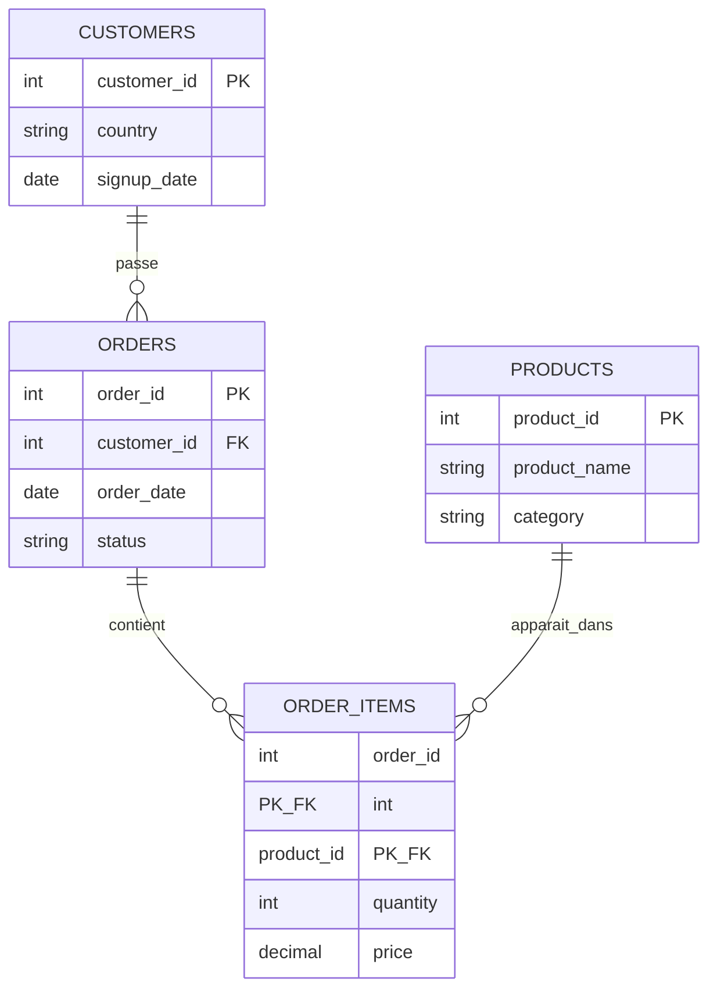

# 🛒 Schéma de la base de données E-commerce

## 📌 Aperçu

Ce jeu de données brutes décrit le fonctionnement d'une boutique en ligne et s'articule autour de **4 tables principales** : les clients, leurs commandes, le contenu de ces commandes, et le catalogue produits.

## 🗺️ Diagramme entité-relation

## 📋 Description des tables

### 🟢 `customers`
Contient les informations sur les clients qui passent des commandes.

| Colonne | Type | Clé | Description |
|---|---|---|---|
| `customer_id` | INT | PK | Identifiant unique du client |
| `country` | VARCHAR | | Pays du client |
| `signup_date` | DATE | | Date d'inscription du client |

### 🔵 `orders`
Contient les informations sur chaque commande passée par les clients.

| Colonne | Type | Clé | Description |
|---|---|---|---|
| `order_id` | INT | PK | Identifiant unique de la commande |
| `customer_id` | INT | FK | Référence vers `customers.customer_id` |
| `order_date` | DATE | | Date à laquelle la commande a été passée |
| `status` | VARCHAR | | Statut de la commande (ex : livrée, en cours, annulée) |

### 🟣 `order_items`
Contient les articles (produits) de chaque commande, avec leur quantité et leur prix.

| Colonne | Type | Clé | Description |
|---|---|---|---|
| `order_id` | INT | PK, FK | Référence vers `orders.order_id` |
| `product_id` | INT | PK, FK | Référence vers `products.product_id` |
| `quantity` | INT | | Quantité commandée pour ce produit |
| `price` | DECIMAL(10,2) | | Prix unitaire au moment de la commande |

> ⚠️ `order_items` utilise une **clé primaire composite** (`order_id`, `product_id`) afin de garantir qu'un même produit n'apparaisse qu'une seule fois par commande.

### 🟠 `products`
Contient les informations sur les produits disponibles dans la boutique.

| Colonne | Type | Clé | Description |
|---|---|---|---|
| `product_id` | INT | PK | Identifiant unique du produit |
| `product_name` | VARCHAR | | Nom du produit |
| `category` | VARCHAR | | Catégorie du produit |

## 🔗 Relations

| Relation | Cardinalité | Description |
|---|---|---|
| `customers.customer_id` → `orders.customer_id` | 1 → N | Un client peut passer plusieurs commandes |
| `orders.order_id` → `order_items.order_id` | 1 → N | Une commande peut contenir plusieurs articles |
| `products.product_id` → `order_items.product_id` | 1 → N | Un produit peut apparaître dans plusieurs lignes de commande |

## 🧭 Légende

- 🔑 **PK (Primary Key)** : identifie de façon unique chaque enregistrement d'une table.
- 🔗 **FK (Foreign Key)** : fait référence à la clé primaire d'une autre table.
- **1 → N** : relation un-à-plusieurs (*one-to-many*).

---

*Document généré à partir du schéma de la base de données e-commerce.*
